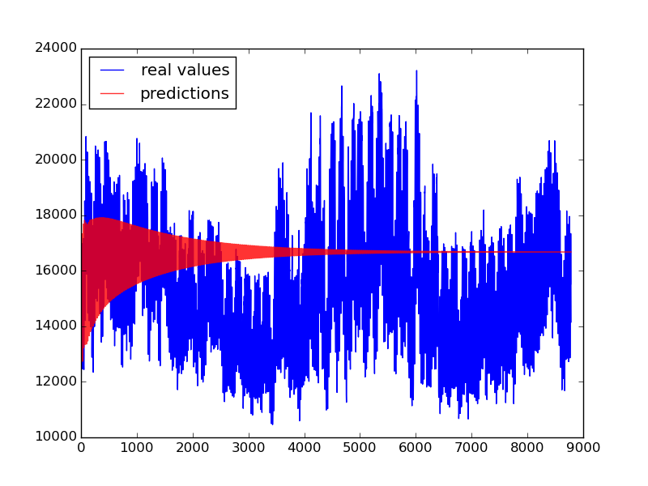
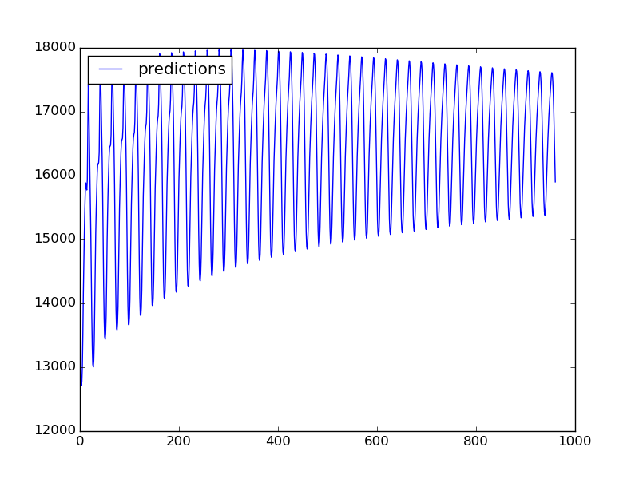

# Power-Usage-Data-Time-Series-Analysis
Parametric and Non-Parametric Model for Power Usage Data Time Series Analysis - First Project of Statistical Mahchine Learning

    

        
    

    

        Raw Data
    

    

        
    

    

        Real Data vs Auto Regression Prediction
    

    

        
    

    

        Auto Regression model
    

The analysis of experimental data that have been observed at different points in time leads to new and unique problems in statistical modeling and inference. In this project, our goal was to predict the power usage of Ontario state, Canada, using recorded usage data from January 2002 to December 2016. We implemented parametric and non-parametric models and compared them with respect to various evaluation metrics. Second project of Statistical Machine Learning course

